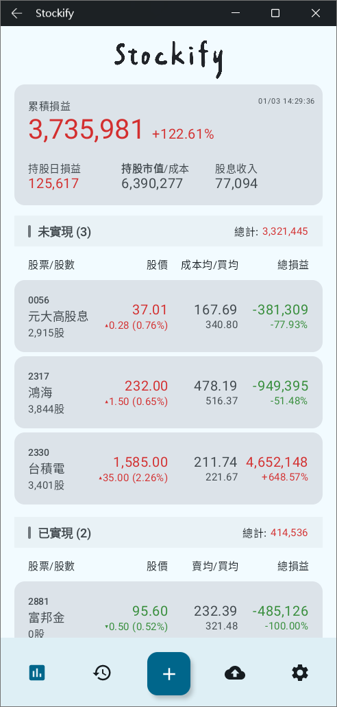
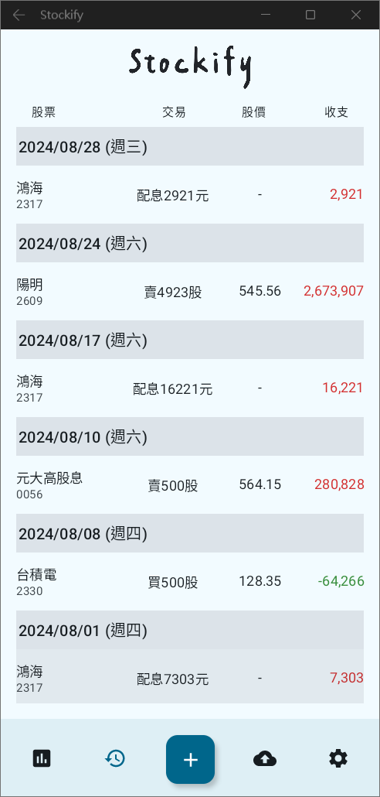
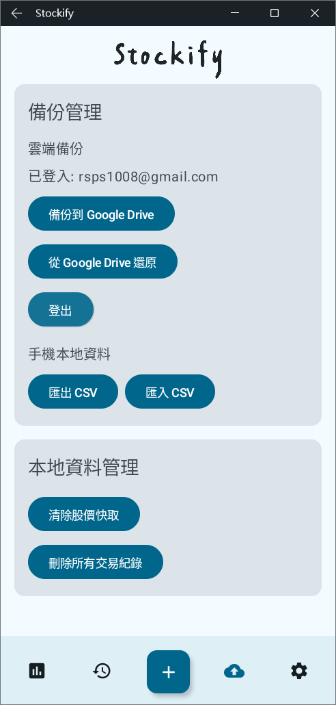
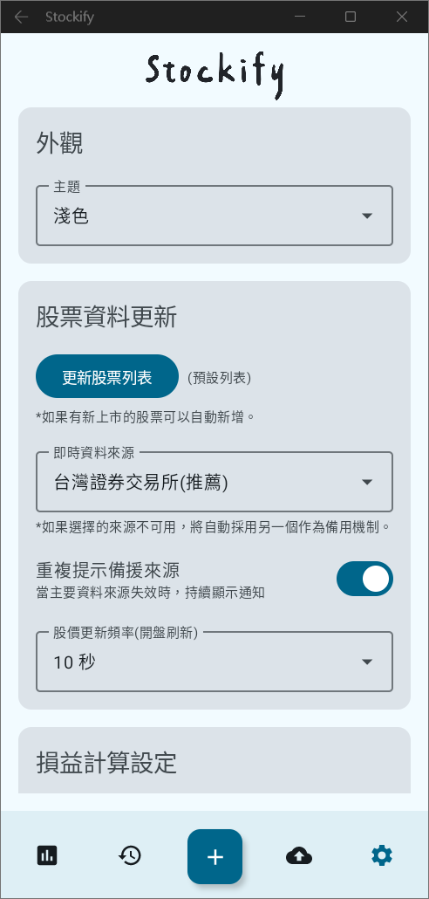
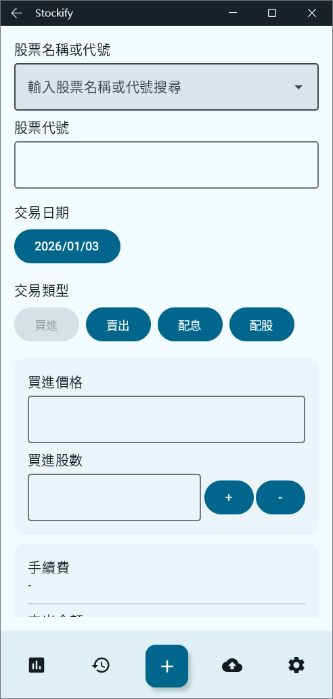
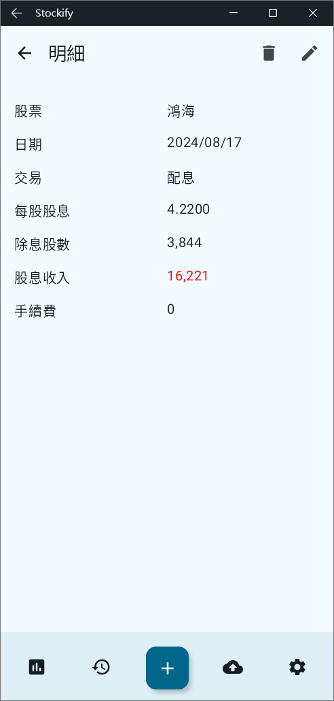
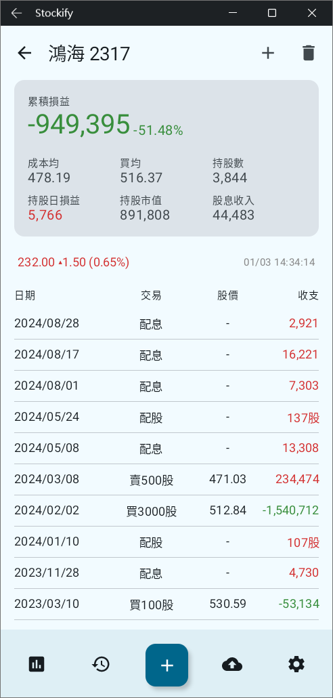

# Stockify - 您的個人股票帳本

## 前言

這是一個為了紀念與取代舊版 `com.bigmiracle.stockify` 而生的專案。

過去，`com.bigmiracle.stockify` 是一款出色的免費股票記帳軟體，許多人都曾依賴它來管理自己的投資。然而，最近它不僅開始收費，還導入了 Play Integrity 機制，使得在電腦模擬器上使用的用戶無法繼續順利記帳。

為了重現那段美好的免費使用時光，並確保投資管理者在任何裝置上都能自由操作，我借助 Vibe-Coding、Gemini 和 GPT 的力量，從頭打造了這個全新的 Stockify。它開源、免費，且永遠歡迎社群共同改進。

## 功能截圖

### 核心功能展示
| 01 - 主畫面 | 02 - 交易明細 | 03 - 資料管理 |
| :---: | :---: | :---: |
|  |  |  |

### 更多介面
| 04 - 設定 | 05 - 新增資料 | 06 -詳細1 | 07 - 詳細2 |
| :---: | :---: | :---: | :---: |
|  |  |  |  |

## 更新紀錄

### [v1.0.4] - 2026-01-27
**新增與優化內容：**
- **最新配息配股頁面**：
    - 實作「最新配息配股查詢」功能，自動抓取 Yahoo Finance 除權息資料。
    - 整合本地交易紀錄，於頁面顯示「上次領取」金額與日期，方便比對。
    - 支援自動排序，將除權息日期最近的股票排在最前方。
    - 首頁右上方新增「$」便捷入口。
- **操作流程優化**：
    - 智慧填入：在「股票詳情」頁面點擊新增交易時，系統將自動預填該股票代號及名稱。
    - 長按提示：首頁「$」按鈕新增長按說明，提升介面易用性。
- **效能與系統維護**：
    - 重構 Navigation 導航邏輯，修復重複建立 Composable 的問題。
    - 優化路徑參數傳遞機制，解決 null 字串顯示之 Bug。

### [v1.0.3] - 2026-01-22
- 初始版本基礎功能對外發布。

## 專案總覽

Stockify 是一款使用 Kotlin 和 Jetpack Compose 開發的原生 Android 應用程式，旨在幫助您輕鬆追蹤股票投資組合與交易紀錄。專案遵循現代化的 Android 開發實踐，擁有清晰的架構和完善的依賴管理。

*   **程式語言:** Kotlin
*   **UI 框架:** Jetpack Compose with Material 3
*   **最低 Android 版本:** API 26 (Android 8.0 Oreo)

### 核心技術

*   **UI:** 使用 Jetpack Compose 進行宣告式 UI 開發，並採用 Material 3 設計風格。
*   **架構:** MVVM (Model-View-ViewModel)。
*   **導航:** 使用 Jetpack Navigation for Compose 管理畫面切換。
*   **本地儲存:**
    *   **Room:** 用於儲存交易、持股等結構化資料。
    *   **DataStore:** 用於儲存簡易的鍵值對設定。
*   **網路請求:** Ktor HTTP Client。
*   **HTML 解析:** Jsoup，用於爬取網路上的股票資料。

### 如何編譯與執行

您可以使用 Android Studio 或透過指令列來編譯與執行此專案。

**指令列操作** (Windows 請使用 `gradlew.bat`):

*   **編譯 Debug 版本:**
    ```shell
    ./gradlew assembleDebug
    ```

*   **執行單元測試:**
    ```shell
    ./gradlew test
    ```

*   **安裝到連接的裝置或模擬器:**
    ```shell
    ./gradlew installDebug
    ```

## 使用介紹

Stockify 的操作介面直觀簡潔，主要功能都圍繞著「持股」與「交易」兩大核心。

### 1. 新增您的第一筆交易

*   **初次使用:** 應用程式會引導您新增第一筆股票資料。
*   **日常操作:** 點擊主畫面的「新增交易」按鈕。
*   **輸入資訊:**
    *   **股票代號:** 輸入您交易的股票代號。
    *   **交易類型:** 選擇「買入」或「賣出」。
    *   **股數:** 輸入交易的股數。
    *   **價格:** 輸入每股的成交價格。
    *   **日期:** 選擇交易發生的日期。
*   **完成:** 按下儲存後，這筆交易便會記錄在您的手機中。

### 2. 查看持股狀況

*   **持股總覽:** 主畫面會以列表形式顯示您目前持有的所有股票。
*   **即時損益:** 每支股票都會顯示目前的股數、平均成本、現價以及預估的損益。
*   **資料來源:** 股價資訊會透過網路即時更新。

### 3. 管理交易紀錄

*   **交易列表:** 您可以隨時查看過去所有的買賣紀錄。
*   **編輯與刪除:** 如果有任何輸入錯誤，您可以輕易地修改或刪除單筆交易紀錄。

### 4. 匯入與匯出

CSV 匯入與匯出的功能，並且能夠備份至Google雲端硬碟，讓您能夠:

*   從其他軟體無痛轉移您的交易紀錄。
*   將 Stockify 的資料備份或用於其他分析工具。

希望這份文件能幫助您快速上手！

---

此段內容由Gemini所產生
