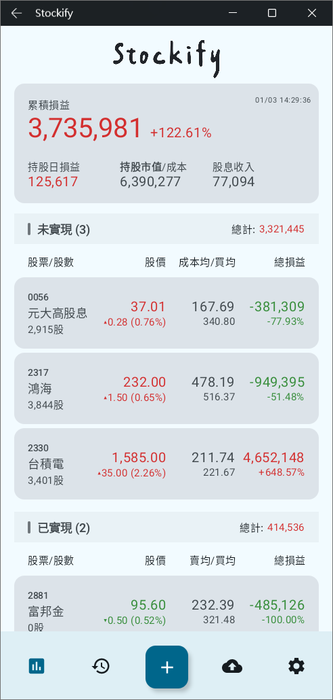
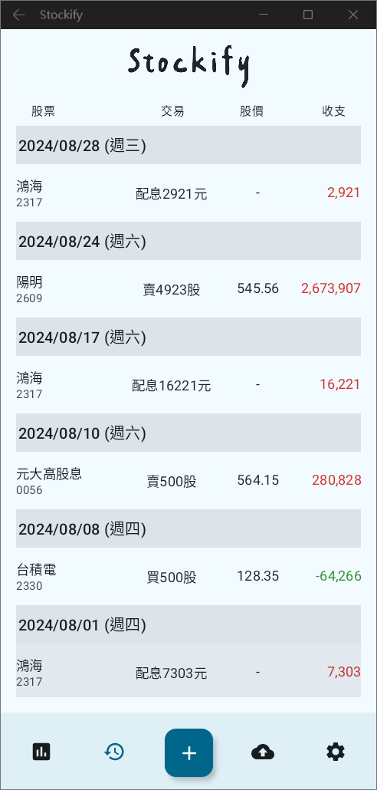
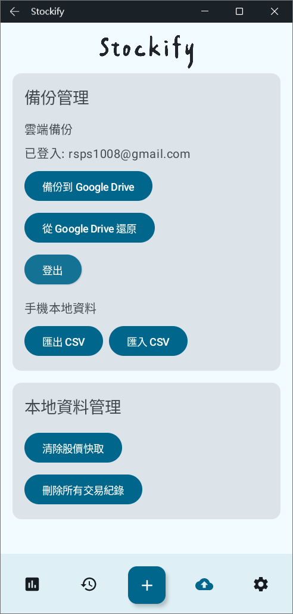
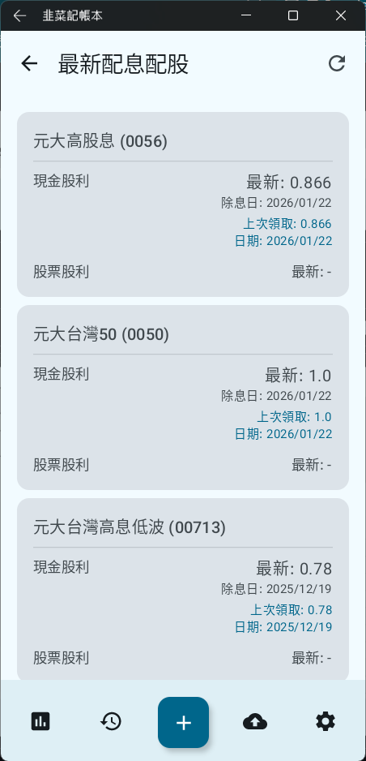
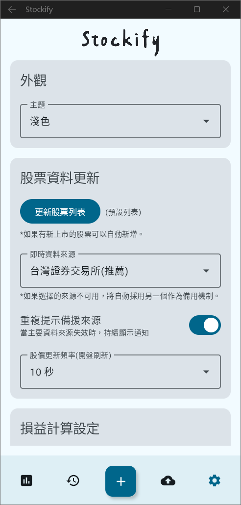
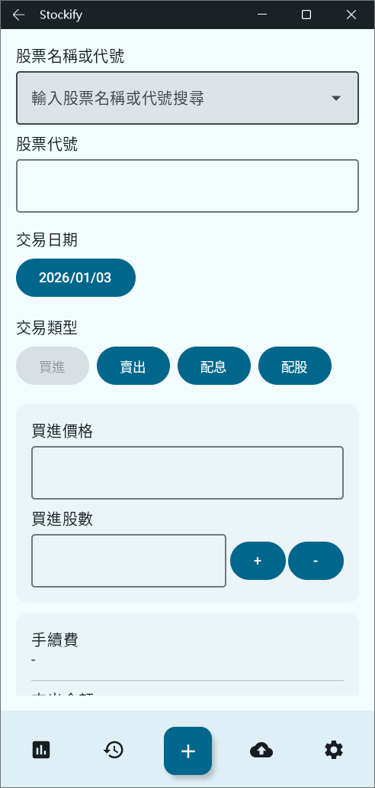
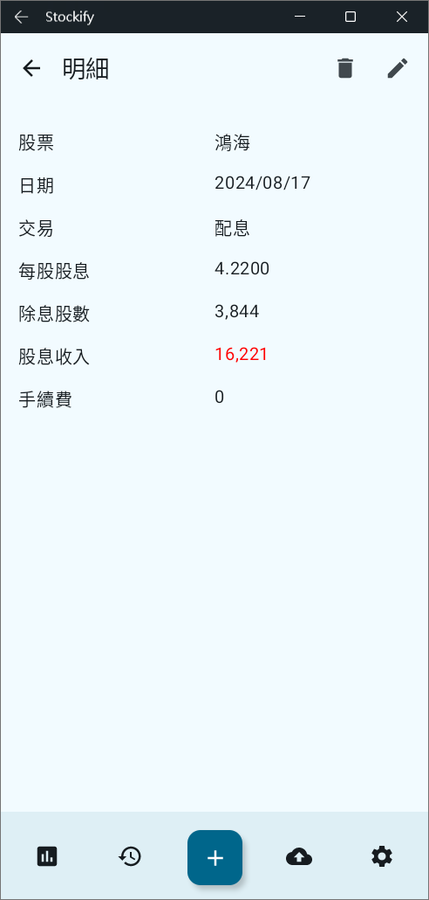
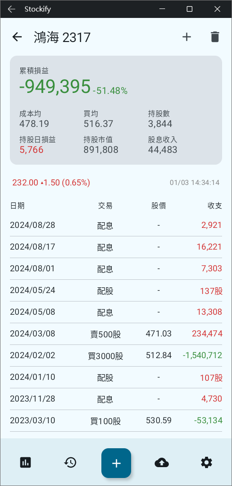

# 韭菜記帳本（Stockify）

韭菜記帳本（Stockify）是一款開源、免費的 Android 股票投資組合與交易記帳 App，支援台股與美股、即時報價、股利紀錄、歷史損益分析，以及本地與 Google Drive 備份。

## 功能特色

### 持股與交易

- 管理買進、賣出、配息、配股、減資與股票分割交易。
- 支援多個投資帳戶，可切換單一帳戶或合併檢視全部帳戶。
- 交易可記錄日期、價格、股數、手續費、交易稅、收入/支出與交易筆記。
- 台股股數以整張操作為主；美股支援小數股與美元 cents。
- 自動計算的支出、收入、股息與配股數量可手動覆寫，並可選擇四捨五入或無條件捨去。

### 台股與美股

- 首頁支援純台股、純美股與台股 + 美股合併檢視。
- 合併檢視會使用 USD/TWD 匯率將美股金額換算為台幣；個股頁仍顯示原始幣別。
- 台股即時報價支援 TWSE / Yahoo；美股支援 Nasdaq / Yahoo，主來源失敗時各自只進行一次備援切換。
- 報價服務會依台灣與美國市場的交易時間分流更新，App 啟動時會先強制取得最新價格。
- 可在設定頁更新台股股票清單；美股清單可使用 Finnhub 免費 API key 更新。

### 損益與圖表

- 首頁顯示持股市值、成本、未實現損益、已實現損益、股息收入與台灣加權指數摘要。
- 未實現與已實現持股支援收合/展開、長按拖曳排序，以及依股票、股數、均價、損益金額或損益百分比排序。
- 提供三種報酬率計算方式：剩餘部位成本、歷來投入成本、年化報酬 XIRR。
- 首頁與個股詳情均提供歷史走勢與報酬圖表；歷史資料統計至昨天，並正確處理分割、減資與股利現金流。
- 報酬曲線會依正負損益分色，並在適當範圍顯示 0% 基準線。

### 股利與資料管理

- 從 Yahoo Finance 查詢持股最新配息/配股資料，並與本地歷史領取紀錄比對。
- CSV 匯入/匯出包含市場與帳戶資訊，方便跨版本或跨工具移轉。
- 支援 Google Drive 備份與還原交易、帳戶、持股排序及即時價格相關資料。
- 支援本地交易、帳戶名稱與持股排序備份/還原。
- 支援匯入集保 E 存摺加密 PDF；輸入密碼後可解析庫存、抓取現價並預覽，選擇替代匯入或新增匯入。
- 可分別刪除交易資料，或清除交易、帳戶、排序與即時價格快取；股票代號主清單會保留。

### 使用體驗

- Jetpack Compose + Material 3 介面，支援淺色、深色與 AMOLED 全黑主題。
- 可調整全 App 文字大小。
- 個股詳情頁可直接開啟 Yahoo Finance WebView。
- 首頁與交易頁使用淡入淡出轉場，並提供即時報價刷新時間與手動刷新入口。

## 功能截圖

| 主畫面 | 交易明細 | 資料管理 | 除權息查詢 |
| :---: | :---: | :---: | :---: |
|  |  |  |  |

| 設定 | 新增交易 | 個股詳情 1 | 個股詳情 2 |
| :---: | :---: | :---: | :---: |
|  |  |  |  |

## 技術架構

- **語言與 UI：** Kotlin、Jetpack Compose、Material 3
- **架構：** MVVM，依 `data/`、`ui/viewmodel/`、`ui/screens/` 分層
- **本地資料：** Room 儲存股票、帳戶、交易與歷史價格；DataStore 儲存設定、快取與排序
- **網路：** Ktor HTTP Client、Jsoup；報價與股利資料來自 TWSE、Yahoo Finance、Nasdaq、Finnhub
- **PDF：** PDFBox Android，用於集保 E 存摺 PDF 解密與文字抽取
- **最低版本：** Android API 26
- **目前版本：** 1.5.6（versionCode 1560）

## 編譯與執行

需求：Android Studio、JDK 21、Android SDK API 36。

Windows PowerShell：

```powershell
./gradlew.bat assembleDebug
./gradlew.bat compileDebugKotlin
./gradlew.bat test
./gradlew.bat installDebug
```

## 授權

本專案採用 [MIT License](./LICENSE)。使用、複製、修改、合併、發布與散布衍生作品時，請保留原始版權與授權聲明。

## 隱私政策

請參考 [韭菜記帳本隱私政策](https://rsps1008.github.io/Stockify/privacy-policy/)。

本專案源自希望延續免費股票記帳工具的想法，歡迎提出 Issue 或 Pull Request 一起改進。
